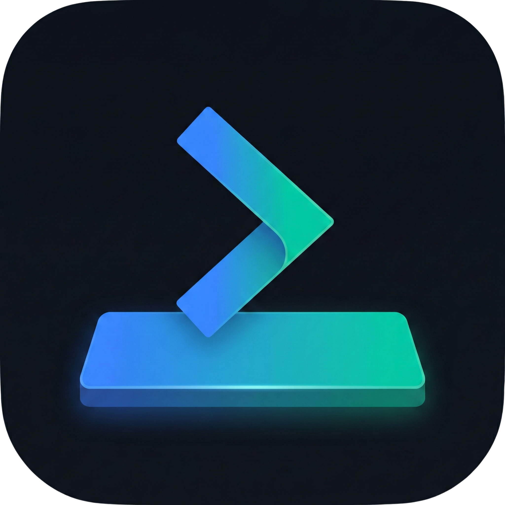

<p align="center">
  
</p>

<h1 align="center">CommandDock</h1>

<p align="center">
  <strong>The contextual command panel for developers.</strong><br>
  Auto-detects your project stack and gives you one-click command execution.
</p>

<p align="center">
  
  
  
  
  
</p>

<p align="center">
  <a href="https://github.com/codeaeternum/commanddock/releases">📥 Download</a> •
  <a href="https://codeaeternum.com/commanddock.html">🌐 Website</a> •
  <a href="https://codeaeternum.com/commanddock-changelog.html">📋 Changelog</a> •
  <a href="https://ko-fi.com/codeaeternum">☕ Support</a>
</p>

---

## Features

- **⚡ Auto-Detection** — Scans your workspace and detects Git, Node.js, Docker, Python, Rust, Go, Java, Flutter, Tailwind, Firebase, Turborepo, and 20+ stacks automatically.
- **🎯 One-Click Execution** — Run commands directly via Electron's `child_process`. No copy-paste needed.
- **🔧 Custom Variables** — Define `{{branch}}`, `{{host}}`, `{{user}}` and more. Variables are injected into commands with live preview.
- **⌨️ Command Palette** — Press `Ctrl+K` to fuzzy-search across all commands. Find and run anything in under a second.
- **📂 Smart Workspace** — Drag & drop project folders, browse directories, or enter paths manually. Re-scan to detect new projects instantly.
- **⭐ Favorites & Shortcuts** — Star your most-used commands. Run favorites with `Ctrl+1` through `Ctrl+9`.
- **🌐 Multilingual** — Built-in Spanish and English support with instant language switching.
- **📤 Export / Import** — Back up your entire config — variables, favorites, custom commands — as a single JSON file.
- **🛡️ Dry Run Mode** — Preview commands without executing. See exactly what would run.
- **📜 History Panel** — Recent command execution log with timestamps.
- **🛠 Custom Commands** — Add your own commands to any project.
- **🔔 OS Notifications** — Get notified when long-running commands complete.
- **💬 Feedback** — Built-in bug report and feature request system.

## Installation

### Download (Recommended)

1. Go to [Releases](https://github.com/codeaeternum/commanddock/releases)
2. Download the latest `.exe` (portable, no installation needed)
3. Run `CommandDock.exe`

### Build from Source

```bash
git clone https://github.com/codeaeternum/commanddock.git
cd commanddock
npm install
npm run electron:build:win    # Windows
npm run electron:build:mac    # macOS
```

## Development

```bash
npm install
npm run electron:dev
```

## Keyboard Shortcuts

| Key | Action |
|-----|--------|
| `Ctrl+K` | Command Palette |
| `Ctrl+J` | Toggle Terminal |
| `Ctrl+H` | Toggle History |
| `Ctrl+1-9` | Run Favorite |
| `Esc` | Close Panels |

## Tech Stack

| Layer | Technology |
|-------|------------|
| Main Process | Electron 40 + Node.js |
| Renderer | React 19 + Vite 7 |
| Styling | Inline styles (dark theme) |
| Packaging | electron-builder |
| Config | JSON persistence (`~/.commanddock/config.json`) |

## Project Structure

```
commanddock/
├── electron/
│   ├── main.js          # Main process + IPC handlers
│   ├── preload.js       # Context bridge (secure API)
│   └── config.js        # ConfigManager (JSON persistence)
├── src/
│   ├── App.jsx          # Main component + routing
│   ├── components/
│   │   ├── CommandCard.jsx      # Individual command display
│   │   ├── CommandGroup.jsx     # Grouped commands by stack
│   │   ├── CommandPalette.jsx   # Ctrl+K fuzzy search
│   │   ├── ConfigPanel.jsx      # Variables & settings
│   │   ├── CustomCommands.jsx   # User-defined commands
│   │   ├── FeedbackModal.jsx    # Bug/feature reports
│   │   ├── HistoryPanel.jsx     # Execution history
│   │   ├── ProjectPicker.jsx    # Workspace management
│   │   ├── SetupWizard.jsx      # First-run onboarding
│   │   ├── Terminal.jsx         # Built-in terminal output
│   │   └── Toast.jsx            # Notifications
│   ├── data/
│   │   ├── commands.js    # 100+ built-in commands
│   │   ├── stacks.js      # Stack detection rules
│   │   ├── variables.js   # Variable definitions
│   │   ├── contexts.js    # Context groups
│   │   └── locales.js     # i18n (EN/ES)
│   ├── hooks/
│   │   ├── useConfig.js            # Config persistence
│   │   ├── useProjectDetection.js  # Stack scanner
│   │   └── useCommandExecution.js  # Command runner
│   └── utils/
│       └── env.js         # Environment detection
├── assets/
│   └── icon.png           # App icon
├── index.html
├── vite.config.js
└── package.json
```

## Privacy

CommandDock runs entirely locally on your machine.
- No user data is sent to external servers
- Config is stored locally at `~/.commanddock/config.json`
- Feedback submissions go through Google Forms (opt-in only)
- Full privacy policy: [codeaeternum.com/privacy.html](https://codeaeternum.com/privacy.html)

## Support

- 🌐 Website: [codeaeternum.com](https://codeaeternum.com)
- 𝕏 Twitter: [@CodeAeternum](https://x.com/CodeAeternum)
- ☕ Support development: [ko-fi.com/codeaeternum](https://ko-fi.com/codeaeternum)
- 💬 Feedback: Use the built-in feedback button or [email us](mailto:codeaeternum@outlook.com)

## License

MIT © [Code Aeternum](https://codeaeternum.com)
